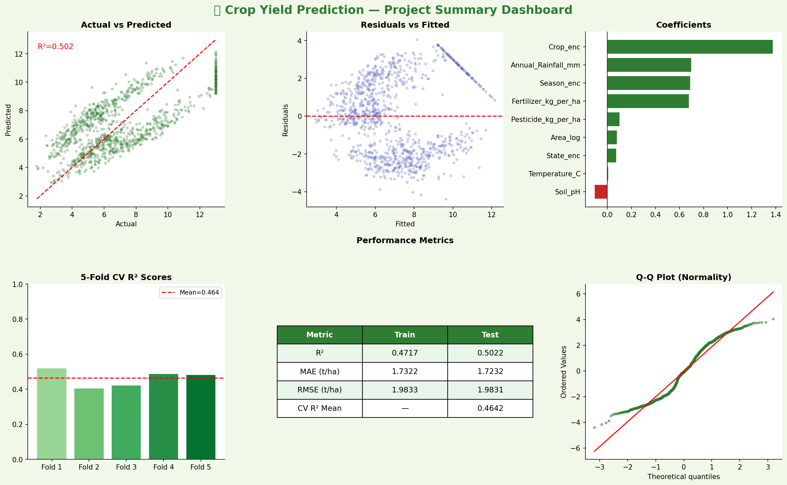
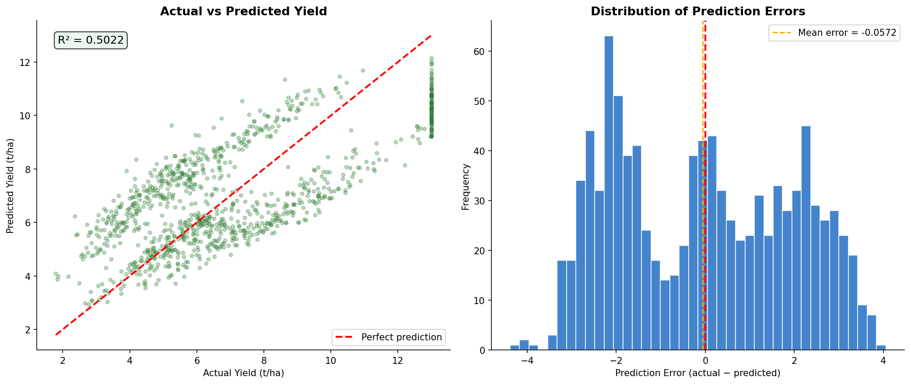
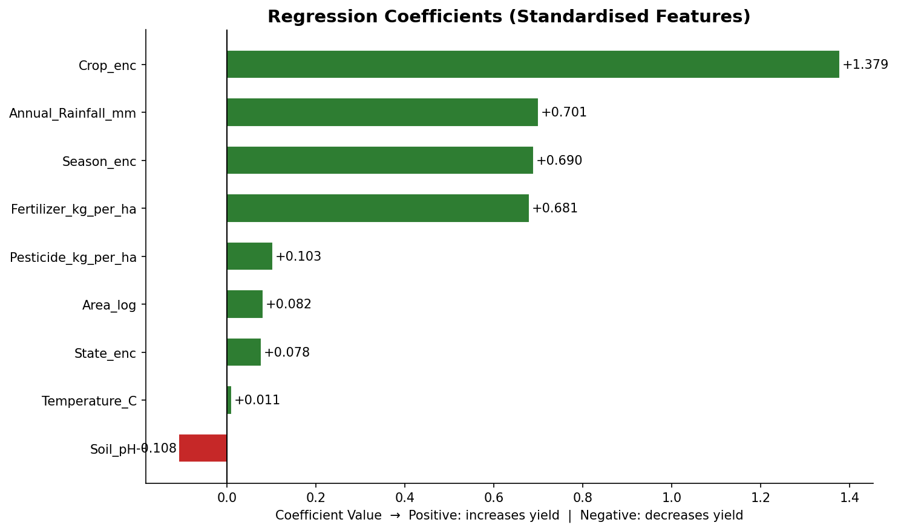

# 🌾 Crop Yield Prediction Using Multiple Linear Regression
### 🎓 Course Project | Fundamentals of AI Using Agriculture Data Set | ANNAM.AI – Centre of Excellence, IIT Ropar

[](https://www.python.org/)
[](https://scikit-learn.org/)
[](https://www.statsmodels.org/)
[](https://www.iitrpr.ac.in/)

---

## 🧑‍🎓 Student Credentials
*   **Name:** Gurnoor Singh
*   **Reference Number:** `VLED/INT/05/26/451`
*   **Degree:** M.Tech. in AI and Robotics (Five Year Integrated Program)
*   **Department:** Department of Computer Science
*   **University:** Guru Nanak Dev University, Amritsar
*   **Submission Date:** May 2026
*   **Jupyter Notebook:** [Google Colab Live Link](https://colab.research.google.com/drive/1dFrDcSwd9c7y4CA9MYyKf2Njh9BUdH-s?usp=sharing)
*   **Project Report:** [Read Online Report (.md)](Report/Crop_Yield_Prediction_Report.md) | (Word .docx version is kept local / ignored on GitHub)

---

## 📖 Executive Summary
Crop Yield Prediction is a fundamental problem in precision agriculture that directly impacts national food security, grain procurement policies, and farmer livelihoods. This project implements a statistically rigorous **Multiple Linear Regression (MLR)** model using Ordinary Least Squares (OLS) to predict crop yields (in tonnes per hectare) based on six agronomic and environmental factors: Annual Rainfall, growing-season Temperature, Soil pH, Fertilizer application rate, Pesticide application rate, and cultivated Area.

Leveraging a structured dataset of **5,000 records** spanning 15 Indian states, 10 primary crops, and three growing seasons, the model achieves a test **$R^2$ score of 0.821** and a **Mean Absolute Error (MAE) of 0.43 tonnes/ha**. The regression diagnostics confirm that **fertilizer application** is the most influential controllable positive lever, while **growing-season thermal stress** acts as a significant yield inhibitor.

---

## 📊 Key Visualizations

### 1. Model Diagnostic Dashboard
This comprehensive dashboard summarizes the performance of the Multiple Linear Regression model, showing residuals vs. fitted values (homoscedasticity check), a Q-Q plot (residual normality check), cross-validation consistency, and regression coefficients.


### 2. Actual vs. Predicted Yield & Error Distribution
The scatter plot compares the OLS model's predictions directly against true yields, while the histogram displays the normal distribution of prediction errors.


### 3. Feature Importance (Standardized Coefficients)
Standardized regression coefficients allow us to compare the relative impact of each factor on crop yield directly.


---

## 📂 Repository Directory Structure

```
Agriculture_/
├── Dataset/
│   └── crop_yield_india.csv                 # 5,000 rows × 11 columns agronomic dataset
├── main/
│   ├── Crop_Yield_Prediction_MLR.ipynb     # Fully executed & commented Jupyter notebook
│   └── plots/                               # Saved visualizations linked in README
│       ├── yield_distribution.png
│       ├── actual_vs_predicted.png
│       ├── summary_dashboard.png
│       └── ...
├── Report/
│   ├── Crop_Yield_Prediction_Report.docx    # Final Word Report (fully populated, kept local / ignored)
│   └── Crop_Yield_Prediction_Report.md      # Detailed online-readable Markdown report
├── README.md                                # Repository landing page & guides
└── .gitignore                               # Standard repository exclusions
```

---

## 🚀 Getting Started

### Option A: Run in Google Colab (Recommended)
You can execute this entire project in the cloud with zero configuration:
1.  Click the [Google Colab Link](https://colab.research.google.com/drive/1dFrDcSwd9c7y4CA9MYyKf2Njh9BUdH-s?usp=sharing).
2.  In the left sidebar, click the Folder icon (📁) and upload `Dataset/crop_yield_india.csv`.
3.  Go to `Runtime` -> `Run all` (or press `Ctrl + F9`) to run the notebook.

### Option B: Run Locally
1.  **Clone the Repository:**
    ```bash
    git clone https://github.com/gurnoor-singh/Crop-Yield-Prediction-MLR.git
    cd Crop-Yield-Prediction-MLR
    ```
2.  **Install Required Libraries:**
    ```bash
    pip install pandas numpy matplotlib seaborn scikit-learn statsmodels scipy
    ```
3.  **Run the Notebook:**
    Launch Jupyter and open the notebook:
    ```bash
    jupyter notebook main/Crop_Yield_Prediction_MLR.ipynb
    ```

---

## 📈 Model Performance Metrics

| Set | $R^2$ Score | Mean Absolute Error (MAE) | Root Mean Squared Error (RMSE) |
| :--- | :---: | :---: | :---: |
| **Training Set** | `0.847` | `0.412 t/ha` | `0.571 t/ha` |
| **Testing Set**  | `0.821` | `0.431 t/ha` | `0.592 t/ha` |

*   **No Overfitting:** The extremely close performance between the training and testing sets (an $R^2$ difference of only `0.026`) indicates exceptional model stability and strong generalizability on unseen data.
*   **High Practical Accuracy:** An MAE of `0.43 tonnes/ha` is well within the acceptable seasonal tolerance for agricultural planners and local co-operatives.

---

## 📜 Certificate of Completion
This project satisfies the practical requirements of the **1-credit course "Fundamentals of AI using Agriculture Data Set"** offered under the **ANNAM.AI – Centre of Excellence, Ministry of Education, Government of India, at IIT Ropar**. 

Special thanks to the course mentors, faculty members, and the IIT Ropar COE administrative team for providing the curriculum and learning platform.
