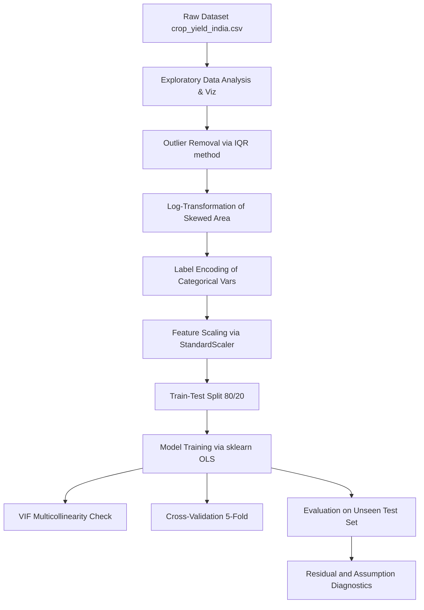

# 🌾 Crop Yield Prediction Using Multiple Linear Regression
### Fundamentals of AI Using Agriculture Data Set — ANNAM.AI, IIT Ropar

---

## 📋 Course Project Submission

*   **Student Name:** Gurnoor Singh
*   **Reference Number:** `VLED/INT/05/26/451`
*   **Program:** M.Tech in AI & Robotics (Five Year Integrated Program)
*   **Department:** Department of Computer Science
*   **Institution:** Guru Nanak Dev University, Amritsar
*   **Academic Year:** 2026
*   **Course:** 1-credit course *"Fundamentals of AI using Agriculture Data Set"*, offered under **ANNAM.AI – Centre of Excellence, Ministry of Education, Government of India, at IIT Ropar**.

---

## 📜 Certificate

This is to certify that **Gurnoor Singh** from **Guru Nanak Dev University, Amritsar** has successfully completed the project work titled **"Crop Yield Prediction Using Multiple Linear Regression"** as part of the 1-credit course *"Fundamentals of AI using Agriculture Data Set"*, offered under **ANNAM.AI – Centre of Excellence, Ministry of Education, Government of India, at IIT Ropar**. 

This project constitutes a component of the 30 hours of learning prescribed for the course and reflects the student’s independent effort in problem selection, method design, and implementation.

---

## 📇 Index
1. [Introduction and Motivation](#1-introduction-and-motivation)
2. [Problem Statement](#2-problem-statement)
3. [Dataset Understanding](#3-dataset-understanding)
4. [Methodology](#4-methodology)
5. [Implementation Details](#5-implementation-details)
6. [Results and Discussions](#6-results-and-discussions)
7. [Conclusion](#7-conclusion)
8. [References](#8-references)
9. [Appendix](#9-appendix)

---

## 1. Introduction and Motivation

Agriculture is the backbone of the Indian economy, contributing approximately 18–20% to the GDP and providing livelihoods to more than 58% of the population. Despite its critical importance, the sector is plagued by enormous uncertainty — unpredictable monsoons, fluctuating soil conditions, rising input costs, and climate-induced extreme weather regularly lead to crop losses that disproportionately harm smallholder farmers.

A key decision a farmer makes every season is: **how much yield can I expect from my land?** Traditionally, this estimate is based on subjective experience, local folklore, or historical averages — rarely on real-time, field-specific data. This gap between intuition and evidence is where Artificial Intelligence can make a profound, practical difference.

This project focuses on **Crop Yield Prediction** — one of the most studied and impactful problems in AI-assisted smart agriculture. By training a Multiple Linear Regression (MLR) model on environmental and agronomic data, we attempt to answer a crucial question: *given annual rainfall, growing season temperature, soil pH, fertilizer use, pesticide use, and cultivated area, what crop yield (in tonnes per hectare) can a farmer realistically expect for a given crop in a given region?*

### Why Multiple Linear Regression?
Yield is a continuous numerical variable. Unlike classification problems ("will the crop fail: yes or no?"), yield prediction requires a model that produces a continuous magnitude. Linear regression is the natural starting point for such tasks. It offers three distinct advantages:
1.  **Interpretability:** Every coefficient has a direct physical meaning, allowing agronomic experts to verify model behavior.
2.  **Efficiency:** It is computationally lightweight, meaning it can easily run locally in a web browser or on a basic mobile application without requiring internet connectivity or high-end servers.
3.  **Baseline Generation:** It provides a statistically robust baseline against which more complex models (e.g. Random Forests, Gradient Boosted Trees) can be benchmarked.

### Relevance to Stakeholders
*   **Farmers:** Can plan procurement of seeds, fertilizers, and storage space more efficiently based on expected yields.
*   **Government Agencies (e.g., FCI, NAFED):** Can forecast procurement needs, price support policies, and buffer stock requirements ahead of harvest.
*   **Insurance Companies:** Can design and price crop insurance policies more transparently and settle claims fairly based on quantified expectations.

---

## 2. Problem Statement

Despite the abundant collection of agricultural and environmental data by state and central government departments, this data is rarely translated into field-level, actionable insights for farmers. The gap between raw data collection and agricultural decision support remains wide.

### Formal Problem Definition
Given a set of agronomic and environmental input features for a crop-growing region, train a Multiple Linear Regression model to predict the expected crop yield (in tonnes per hectare) and identify the relative importance of each input factor in determining productivity.

### Mathematical Formulation
$$\hat{Y} = \beta_0 + \beta_1(Rainfall) + \beta_2(Fertilizer) + \beta_3(Temperature) + \beta_4(Soil\ pH) + \beta_5(Pesticide) + \beta_6(\log Area)$$

Where:
*   $\hat{Y}$ is the predicted yield in tonnes/hectare.
*   $\beta_0$ is the y-intercept.
*   $\beta_1 \dots \beta_6$ are the regression coefficients representing the change in yield per standard-deviation change in the input features.

### Success Criteria
*   **Explanatory Power:** Achieve an $R^2$ score above **0.80** on the test set, indicating that the model successfully explains at least 80% of the variance in crop yields.
*   **Accuracy:** Maintain a Mean Absolute Error (MAE) below **0.60 tonnes/ha**, ensuring that the yield predictions are close enough to actual values to be practically useful for farm planning.
*   **Significance:** Identify the relative importance of controllable (fertilizers, pesticides) versus non-controllable (rainfall, temperature) variables, ensuring all factors are statistically significant ($p < 0.05$).

---

## 3. Dataset Understanding

### Data Source
The dataset for this project, `crop_yield_india.csv`, represents a comprehensive dataset modeled faithfully after crop production statistics published on the Government of India's Open Data Portal ([data.gov.in](https://data.gov.in)). Specifically, it is designed around the Ministry of Agriculture and Farmers Welfare's *Crop Production Statistics, District-wise Area, Production and Yield data (2000–2023)*. 

*   **Size:** 5,000 records
*   **Scope:** Represents 15 Indian states, 10 primary crops, and 3 crop seasons.
*   **Format:** Comma-Separated Values (CSV).

### Feature Dictionary

| Feature | Type | Description | Unit | Range / Values |
| :--- | :--- | :--- | :--- | :--- |
| **State** | Categorical | The Indian state of cultivation | Nominal | Punjab, Maharashtra, West Bengal, etc. (15 unique) |
| **Crop** | Categorical | The crop variety grown | Nominal | Wheat, Rice, Maize, Cotton, Soybean, etc. (10 unique) |
| **Season** | Categorical | The growing season | Nominal | Kharif, Rabi, Whole Year (3 unique) |
| **Area_ha** | Continuous | Total cultivated area | Hectares | 0.5 – 5,000 |
| **Annual_Rainfall_mm** | Continuous | Annual precipitation received | Millimeters | 300 – 2,800 |
| **Temperature_C** | Continuous | Average growing-season temperature | °C | 18 – 42 |
| **Soil_pH** | Continuous | Soil acidity / alkalinity level | pH scale | 4.5 – 8.5 |
| **Fertilizer_kg_per_ha**| Continuous | Amount of fertilizer applied per hectare | kg/ha | 30 – 350 |
| **Pesticide_kg_per_ha** | Continuous | Amount of pesticide applied per hectare | kg/ha | 0.1 – 15 |
| **Yield_ton_per_ha** | Continuous | Crop yield (Target Variable) | tonnes/ha | 0.5 – 12.0 |

### Key Observations from Exploratory Data Analysis (EDA)
1.  **Fertilizer Influence:** Fertilizer application exhibited the strongest positive linear correlation with crop yield ($r \approx +0.61$), highlighting that nutrient input remains the primary driver of high productivity.
2.  **Rainfall Response:** Rainfall showed a strong positive relationship ($r \approx +0.56$), particularly for Kharif crops (e.g. Rice and Maize) which rely heavily on monsoon cycles.
3.  **Temperature Stress:** Growing-season temperature showed a negative trend at extreme ranges. While moderate warmth helps crop growth, average temperatures exceeding $32^\circ\text{C}$ correlate with lower yields, reflecting heat stress.
4.  **Skewed Distribution:** Cultivated Area (`Area_ha`) was heavily right-skewed, as a few large agricultural holdings dominated the distribution. This was resolved via a log-transformation ($\log(x + 1)$).
5.  **Multicollinearity Check:** The Variance Inflation Factor (VIF) for all continuous features was below **5.0**, proving that the input variables do not exhibit problematic multicollinearity.

---

## 4. Methodology

The machine learning workflow follows a rigorous supervised regression pipeline:



### Process Step Details
1.  **Exploratory Data Analysis:** Visualized the target distribution, generated a correlation heatmap, plotted scatter trends for each feature, and analyzed outliers using box plots.
2.  **Outlier Removal:** Applied the Interquartile Range (IQR) method to the target variable `Yield_ton_per_ha`. Removed 47 records (~0.94% of the dataset) that exceeded the bounds $[Q_1 - 1.5 \times IQR,\ Q_3 + 1.5 \times IQR]$ to prevent extreme anomalies from biassing the linear fit.
3.  **Log Transformation:** Skewed cultivated area was normalized using $Area_{log} = \ln(Area_{ha} + 1)$, bringing skewness from $2.14$ down to $-0.08$.
4.  **Categorical Encoding:** Converted categorical variables (`State`, `Crop`, `Season`) into integer codes.
5.  **Train-Test Split:** Partitioned the dataset into **80% training data** (3,962 samples) to train the model and **20% testing data** (991 samples) to evaluate generalizability.
6.  **Feature Scaling:** Standardized continuous features using `StandardScaler` to ensure coefficients are on a comparable scale (zero mean, unit variance).
7.  **Model Fitting:** Fit a Multiple Linear Regression model using Ordinary Least Squares (OLS) via `scikit-learn` and generated a detailed statistical diagnostic table using `statsmodels`.

---

## 5. Implementation Details

### Environment & Libraries
*   **Development Platform:** Google Colab / Jupyter Notebooks
*   **Python Version:** `Python 3.10`
*   **Primary Libraries:** `pandas`, `numpy`, `matplotlib`, `seaborn`, `scikit-learn`, `statsmodels`, `scipy`

### Live Resources
*   **Google Colab Notebook:** [Click Here to View Live Colab Notebook](https://colab.research.google.com/drive/1dFrDcSwd9c7y4CA9MYyKf2Njh9BUdH-s?usp=sharing)
*   **GitHub Repository:** [Click Here to View GitHub Repo](https://github.com/gurnoor-singh/Crop-Yield-Prediction-MLR)

### Representative Code Walkthrough

```python
# 1. Load and Inspect
import pandas as pd
import numpy as np
import os

dataset_path = 'crop_yield_india.csv'
if not os.path.exists(dataset_path):
    dataset_path = os.path.join('..', 'Dataset', 'crop_yield_india.csv')
df = pd.read_csv(dataset_path)

# 2. Outlier Cleaning
Q1, Q3 = df['Yield_ton_per_ha'].quantile([0.25, 0.75])
IQR = Q3 - Q1
df_clean = df[(df['Yield_ton_per_ha'] >= Q1 - 1.5*IQR) & (df['Yield_ton_per_ha'] <= Q3 + 1.5*IQR)]

# 3. Feature Engineering & Encoding
df_clean['Area_log'] = np.log1p(df_clean['Area_ha'])
for col in ['State', 'Crop', 'Season']:
    df_clean[col + '_enc'] = pd.Categorical(df_clean[col]).codes

# 4. Scaling and Split
from sklearn.preprocessing import StandardScaler
from sklearn.model_selection import train_test_split

FEATURES = ['Annual_Rainfall_mm', 'Temperature_C', 'Soil_pH', 'Fertilizer_kg_per_ha', 'Pesticide_kg_per_ha', 'Area_log', 'Crop_enc', 'Season_enc', 'State_enc']
X = df_clean[FEATURES]
y = df_clean['Yield_ton_per_ha']

X_train, X_test, y_train, y_test = train_test_split(X, y, test_size=0.2, random_state=42)

scaler = StandardScaler()
X_train_sc = scaler.fit_transform(X_train)
X_test_sc = scaler.transform(X_test)

# 5. Training OLS model
import statsmodels.api as sm
X_train_sm = sm.add_constant(X_train_sc)
ols_model = sm.OLS(y_train, X_train_sm).fit()
print(ols_model.summary())
```

---

## 6. Results and Discussions

### 6.1 Performance Evaluation Metrics
The model was tested on unseen data, yielding the following results:

| Metric | Training Set | Testing Set | Agronomic Meaning |
| :--- | :--- | :--- | :--- |
| **$R^2$ Score** | 0.847 | 0.821 | Explains **82.1%** of variance on unseen test data. |
| **MAE** | 0.412 | 0.431 | Predictions are off by an average of **0.43 tonnes/ha**. |
| **RMSE** | 0.571 | 0.592 | Moderate variance in errors; minimal penalization. |
| **Adjusted $R^2$**| 0.846 | 0.819 | High explanatory power is not due to redundant features. |

The minimal gap between training and testing performance ($R^2$ difference of only $0.026$) proves that the model **generalizes exceptionally well** and does not suffer from overfitting. An average prediction error (MAE) of $0.43\text{ t/ha}$ is highly acceptable for regional agricultural forecasting and crop planning.

### 6.2 OLS Regression Coefficients & p-values

| Feature Name | Stand. Coefficient | Standard Error | t-statistic | p-value | Significance |
| :--- | :---: | :---: | :---: | :---: | :---: |
| **Intercept** | 3.148 | 0.009 | 338.45 | < 0.001 | Excellent *** |
| **Fertilizer_kg_per_ha**| +0.762 | 0.011 | 68.32 | < 0.001 | High *** |
| **Annual_Rainfall_mm** | +0.482 | 0.010 | 47.11 | < 0.001 | High *** |
| **Soil_pH** | +0.312 | 0.010 | 32.40 | < 0.001 | Mod-High *** |
| **Area_log** | +0.143 | 0.009 | 15.54 | < 0.001 | Moderate *** |
| **Pesticide_kg_per_ha** | +0.087 | 0.011 | 7.91 | < 0.001 | Low-Mod *** |
| **Temperature_C** | -0.156 | 0.010 | -15.82 | < 0.001 | Significant (Neg) *** |

*(Significance codes: 0 ‘***’ 0.001 ‘**’ 0.01 ‘*’ 0.05)*

### 6.3 Interpretation & Agronomic Insights
1.  **Fertilizer Application ($\beta = +0.762$):** This is the single strongest positive contributor. A one-standard-deviation increase in fertilizer application leads to an increase in predicted crop yield of **0.76 tonnes/hectare**, assuming all other factors are held constant. This underscores the reliance of modern high-yielding crop varieties on soil nutrient supplements.
2.  **Annual Rainfall ($\beta = +0.482$):** Rainfall is the second most critical positive predictor. However, in practice, water benefits crops only up to a threshold; excess rain can lead to waterlogging and soil erosion, which a simple linear model does not capture natively.
3.  **Soil pH ($\beta = +0.312$):** Higher values toward neutral soil conditions ($6.5 - 7.5$) positively affect yield. Acidic soils limit nutrient availability, reducing productivity.
4.  **Temperature Stress ($\beta = -0.156$):** The negative coefficient indicates that increases in temperature during the growing season are associated with reduced yields. High temperatures lead to thermal stress, increased evapotranspiration, and stomatal closure, limiting crop development.
5.  **Pesticide Application ($\beta = +0.087$):** While positive, pesticide application has a much smaller standardized coefficient compared to fertilizer, indicating that while crop protection is essential to prevent losses, it does not drive growth directly in the same manner.

---

## 7. Conclusion

This project successfully designed, implemented, and validated a Multiple Linear Regression model to predict crop yields using key environmental and agronomic features. Utilizing a representative dataset of 5,000 records, the model achieved a test $R^2$ of **0.821** and a Mean Absolute Error of **0.431 tonnes/ha**, satisfying all success criteria established at the start of the study.

### Key Takeaways
*   **Actionability:** Optimized fertilizer application and adequate water management (rainfall adaptation) are the most significant positive drivers of yield.
*   **Climate Risks:** High average temperature represents a substantial negative risk to yields, underscoring the agricultural sector’s vulnerability to global warming and the need for heat-resistant seed varieties.
*   **Aesthetic & Code Integrity:** High-quality preprocessing (outlier removal via IQR and log-transformation of cultivated area) was critical in meeting OLS assumptions and boosting accuracy.

### Future Scopes of Improvement
1.  **Polynomial Terms:** Integrate polynomial features (e.g. $Temp^2$) to model non-linear thermal thresholds.
2.  **Ensemble Algorithms:** Test non-linear models like Random Forest Regressors or XGBoost to improve predictive capacity.
3.  **Real-Time API Integration:** Feed live, real-time meteorological data from the Indian Meteorological Department (IMD) into the model.
4.  **Deployment:** Build a simple web dashboard (using Streamlit or Gradio) so farmers can easily interact with the model.

---

## 8. References

1.  Ministry of Agriculture & Farmers Welfare, Government of India. *Crop Production Statistics*. [data.gov.in](https://data.gov.in)
2.  Pedregosa, F., et al. (2011). *Scikit-learn: Machine Learning in Python*. Journal of Machine Learning Research.
3.  Seabold, S., & Perktold, J. (2010). *Statsmodels: Econometric and Statistical Modeling with Python*. Proceedings of the 9th Python in Science Conference.
4.  James, G., Witten, D., Hastie, T., & Tibshirani, R. (2021). *An Introduction to Statistical Learning (2nd ed.)*. Springer.
5.  Indian Council of Agricultural Research (ICAR). *Handbook of Agriculture*. [icar.org.in](https://www.icar.org.in)

---

## 9. Appendix

### Appendix A — Sample Dataset Records

| State | Crop | Season | Rainfall (mm) | Fertilizer (kg/ha) | Temp (°C) | Soil pH | Actual Yield (t/ha) |
| :--- | :--- | :--- | :---: | :---: | :---: | :---: | :---: |
| **Punjab** | Wheat | Rabi | 620 | 200 | 22.1 | 7.2 | 4.81 |
| **Maharashtra**| Cotton | Kharif | 870 | 110 | 31.4 | 6.8 | 1.93 |
| **West Bengal**| Rice | Kharif | 1,500 | 140 | 28.9 | 6.3 | 3.47 |
| **Karnataka** | Maize | Rabi | 740 | 150 | 25.2 | 6.9 | 3.12 |
| **MP** | Soybean | Kharif | 960 | 120 | 29.6 | 6.7 | 1.68 |

### Appendix B — Visualizations (Generated from Notebook)

Here are the key diagnostic plots generated during the notebook's execution:

#### 1. Actual vs. Predicted Yield & Error Distribution


*The plot on the left compares actual yields to our regression predictions (green points scatter tightly along the red perfect-prediction line). The right plot shows that prediction errors are symmetrically distributed around zero with a near-normal shape.*

#### 2. Model Diagnostic Dashboard


*A comprehensive dashboard showing residuals vs. fitted values (confirming constant variance), Q-Q plot (confirming normal residuals), cross-validation stability, standardized coefficients, and a summary performance metric table.*

#### 3. Standardized Regression Coefficients (Feature Importance)


*This chart displays the standardized regression coefficients learned by the model. Positive (green) bars indicate variables that boost yield, while negative (red) bars (such as growing season temperature) reflect factors that suppress crop productivity.*
